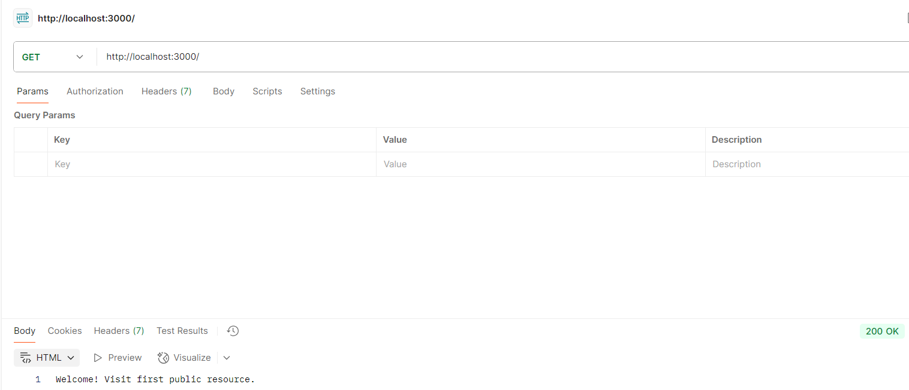

# Simple Authentication Services

This repository contains two demo authentication services built with **Node.js** and **Express**:

1. **Basic Authentication** (`basic_auth.js`)  
2. **Cookie-based Authentication** (`cookie_auth.js`)

---

## Installation

1. Clone the repo:
   ```bash
   git clone https://github.com/minhchau-07/simple_auth.git
cd simple_auth

2. Install dependencies: npm install

## 1. Basic Authentication (basic_auth.js)
### Run the server: node basic_auth.js
Server runs at: http://localhost:3000

### Demo Account:
Username: admin

Password: 12345

### Available Routes:

a. Public Routes

GET / → returns: Welcome! Visit first public resource.

GET /public → returns: Welcome! Visit second public resource.

b. Protected Route

GET /secure → requires Basic Auth header.


- Postman Setup:

Method: GET

URL: http://localhost:3000/secure

Auth tab → choose Basic Auth → enter admin / 12345.


-Expected Results:

Without header → Authentication required. (401)

Wrong credentials → Access denied. (403)

Correct credentials → You have accessed a protected resource 🎉

## 2. Cookie-based Authentication (cookie_auth.js)
### Run the server: node cookie_auth.js
Server runs at: http://localhost:3001

### Demo Account
Username: admin

Password: 12345

### Available Routes
a. Login

POST /login

Body (JSON):
{
  "username": "admin",
  "password": "12345"
}

-Expected Results:

Wrong credentials → Invalid credentials (401)

Correct credentials → response "Logged in!" and cookie auth_cookie_token is set.


b. Profile

GET /profile

Requires cookie auth_cookie_token from login.


-Expected Results:

No cookie → No cookie found (401)

Invalid/expired cookie → Invalid or expired cookie (401)

Valid cookie → Welcome user 1, your cookie is valid.

c. Logout

POST /logout

Removes cookie from DB and clears client cookie.


-Expected Results:

Response: "Logged out."

After logout, calling /profile will return No cookie found.